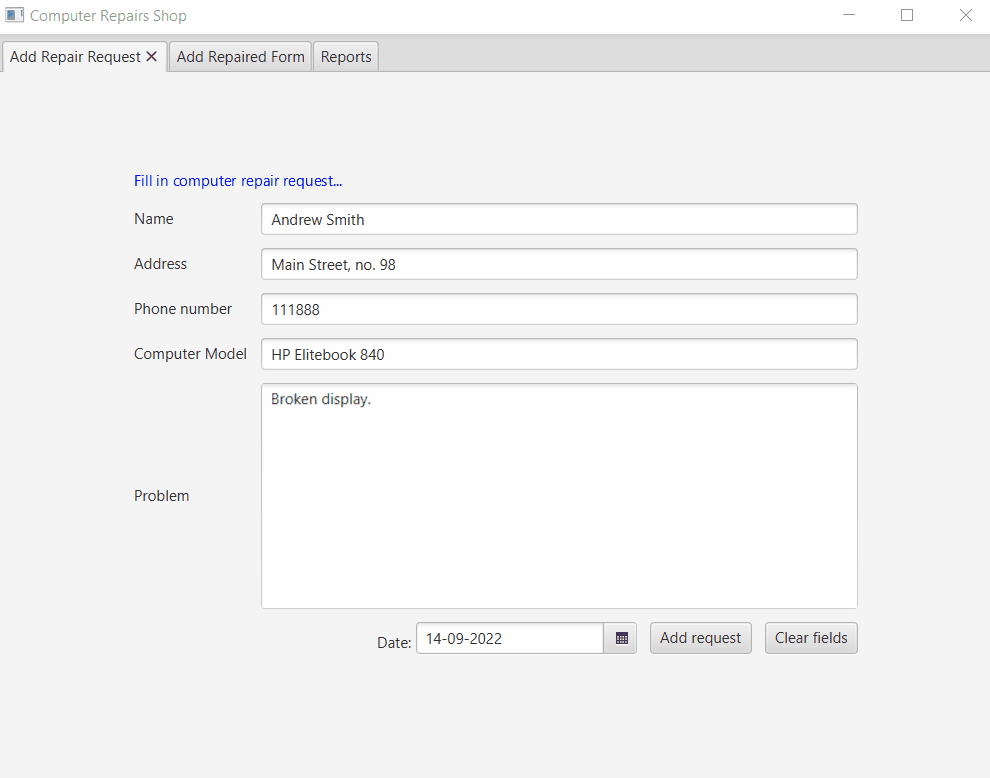

# Computer service form application

University project implemented in Java, using Object-Oriented programming principles. JavaFX library is used for graphical interface of the application. 

The application is a form for a computer service, where users can fill in and submit a form to request a repair. There is an additional tab dedicated to employees, where they can search for a computer model in the database and fill in the repair details. The third tab is reserved for reports, filtering the results according to 3 status: new, finished, cancelled. Data is stored in and retrieved from a *.txt* file. 

<h2> Skills acquired </h2> 

* putting OOP concepts (e.g. Inheritance, Abstraction, Encapsulation) into practice
* working with JavaFX 

<h2> Resources </h2> 

<a href="https://www.javatpoint.com/javafx-tutorial"> JavaFX Tutorial </a> 
